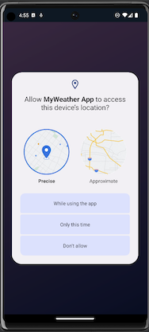
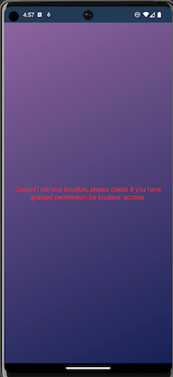

# MyWeather App 🌤

---

### 🌦 Description & functionality:

#### This app allows its users to check the current weather in their location, providing information such as current temperature, humidity, pressure, wind speed, and sky conditions.

### 🌦 Why app like this?

#### I have actually created a weather app as a Java Spring Boot project. I found it very enjoyable as it allowed me to use various tools such as frameworks and learn how to work with REST API services. Additionally, I always wanted to customize a basic weather app on my phone according to my preferences.

### 🌧 Technologies:
- Backend: Kotlin, Dagger - Hilt, Location Services

- API layer: Retrofit, Open-Meteo API

- Build Tool: Gradle

- Version Control: Git

### ⚡ How to run this app?

#### 1. Clone this repository:
` https://github.com/patryk47853/MyWeather-Android-App.git `

#### 2. Run it on your device via Android Studio (required minimum SDK is 28) or use Virtual Device Manager to simply run it on your virtual device.

---

## ⛄ Running service

#### Home page (working app with current weather data and forecast for the whole day):

#### Asking user to grant location tracking permission:

#### No permission granted message:

