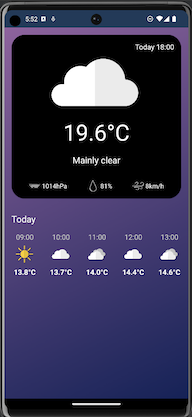
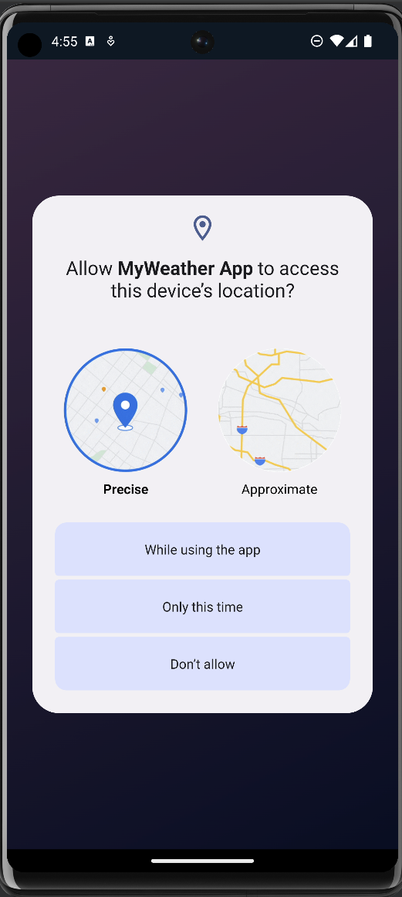
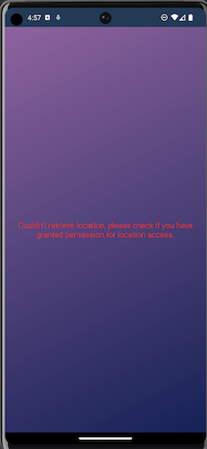

# MyWeather App 🌤

---

### 🌦 Opis i funkcjonalności:

#### Ta aplikacja pozwala użytkownikom sprawdzić aktualną pogodę w ich lokalizacji, dostarczając informacje takie jak aktualna temperatura, wilgotność, ciśnienie, prędkość wiatru i warunki atmosferyczne.

### 🌦 Czemu taka aplikacja?

####  Stworzyłem już podobną aplikację pogodową jako projekt w Java Spring Boot. Było to dla mnie bardzo przyjemne doświadczenie, ponieważ pozwoliło mi to wykorzystać różne narzędzia i frameworki, oraz nauczyć się pracy z usługami REST API. Dodatkowo, zawsze chciałem dostosować podstawową aplikację pogodową na moim telefonie według własnych preferencji.

### 🌧 Technologie:
- Backend: Kotlin, Dagger - Hilt, Location Services

- Warstwa API: Retrofit, Open-Meteo API

- Build Tool: Gradle

- Kontrola wersji: Git

### ⚡ Jak uruchomić tę aplikację?

#### 1. Sklonuj to repozytorium:
` https://github.com/patryk47853/MyWeather-Android-App.git `

#### 2. Uruchom to na swoim urządzeniu za pomocą Android Studio (wymagane minimum SDK 28) lub użyj Virtual Device Manager, aby uruchomić to na wirtualnym urządzeniu.

---

## ⛄ Wygląd uruchomionej aplikacji:

#### Strona główna (działająca aplikacja z danymi pogodowymi wyświetlanymi na bieżąco i prognozą na cały dzień):

#### Prośba o udzielenie zgody na śledzenie lokalizacji:

#### Komunikat o braku udzielonej zgody:

